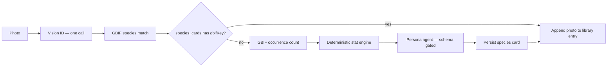

# SpeciesDex

SpeciesDex turns a wildlife photo into one flippable collectible card: an original comic persona on the front and reproducible field-guide game stats on the back. It is a React/Vite + Express/MongoDB project intended for a Render static site, Render web service, and MongoDB Atlas M0 deployment.

## Why the cards stay fair

The canonical ID is GBIF's numeric `usageKey`, never the vision model's text. The capture pipeline first identifies a likely scientific name, resolves it through GBIF, then looks for that `gbifKey` in `species_cards` **before** generating a persona. A unique MongoDB index and short-lived `species_generation_locks` record prevent two concurrent first captures from spending duplicate AI calls.



`server/agents/statEngine.js` is intentionally a pure, model-free function. It uses a version-controlled taxonomic proxy table (for example, `Insecta`, `Aves`, and `Magnoliopsida`) and a stable hash of the GBIF key to produce bounded species-level variation. It never sees image pixels, users, or an LLM.

Rarity first maps available conservation statuses: `LC → Common`, `NT → Uncommon`, `VU → Rare`, `EN → Epic`, and `CR/EW/EX → Legendary`. If unavailable, GBIF observation counts use named thresholds:

| Occurrences | Tier |
| --- | --- |
| ≥ 1,000,000 | Common |
| ≥ 100,000 | Uncommon |
| ≥ 10,000 | Rare |
| ≥ 500 | Epic |
| < 500 | Legendary |

Power Score is a weighted average of Attack (25%), Defense (20%), Speed (20%), Stamina (20%), and Special (15%), then multiplied by the fixed rarity multiplier (1.00–1.40) and clamped to 0–100. The deterministic test runs twice with the same GBIF record and asserts a deep match.

## Run locally

1. Copy the placeholder configuration already present at [`server/.env.example`](server/.env.example) into `server/.env` if needed, then add your MongoDB Atlas URI and OpenAI-compatible LLM credentials. `LLM_API_BASE_URL` should be the complete chat-completions endpoint.
2. Install packages:

   ```bash
   npm install
   npm install --prefix server
   npm install --prefix client
   ```

3. Start both applications:

   ```bash
   npm run dev
   ```

The app is at `http://localhost:5173` and the API health endpoint is `http://localhost:5000/api/health`.

4. Verify the deterministic core:

   ```bash
   npm test
   ```

Optional demo records (after setting `MONGODB_URI`):

```bash
npm run seed --prefix server
```

If no LLM key is present, the dashboard and any existing library remain available in demo mode, but new card creation is disabled with a clear in-product message. Configure an LLM only when you want live vision identification and generated personas.

## Environment

| Variable | Purpose |
| --- | --- |
| `MONGODB_URI` | MongoDB Atlas connection string |
| `LLM_API_KEY` | Provider API credential |
| `LLM_API_BASE_URL` | Full provider chat-completions endpoint |
| `LLM_MODEL` | Vision-capable model name |
| `GBIF_BASE_URL` | Defaults to the free `https://api.gbif.org/v1` |
| `CLIENT_ORIGIN` | Comma-separated allowed frontend origin(s) |
| `PORT` | API port, defaults to 5000 |

## Safety and resilience

- Input data URLs are restricted to JPEG, PNG, or WebP and decoded before enforcing a 5 MB limit.
- `POST /api/capture` is rate limited to 10 requests per minute per IP.
- Helmet, origin-specific CORS, centralized JSON error handling, MongoDB indexes, and `/api/health` are included.
- GBIF calls time out at eight seconds. A failed occurrence lookup uses the documented Common fallback; species-match failure returns a clean retry message.
- Persona output is JSON-schema checked with Ajv, checked against a compact profanity/public-figure/copyright blocklist, retried up to twice with the precise validation issue, and then replaced by a safe template. Each attempt/fallback is logged with `[persona-agent]`.
- User photos are stored in MongoDB base64 for hackathon simplicity and each library entry retains its last 12 sightings.

## Render deployment

The repository includes [`render.yaml`](render.yaml) with a `speciesdex-api` Node web service and `speciesdex-web` static site. Create a MongoDB Atlas free cluster, deploy this repository as a Render Blueprint, and add the server environment values in Render. Set `CLIENT_ORIGIN` to the static site's Render URL. Set `VITE_API_URL` on the static site to the API service URL; no source change is required.

## API

- `POST /api/capture` — accepts `{ imageBase64, userId, deviceMeta? }`; returns the card plus whether it was newly generated or already collected.
- `GET /api/library/:userId` — returns the user's species entries and their stored photos.
- `GET /api/cards/:gbifKey` — returns one cached canonical card.
- `GET /api/leaderboard` — ranks device IDs by summed, unique-card power.
- `GET /api/health` — reports API and DB status.
